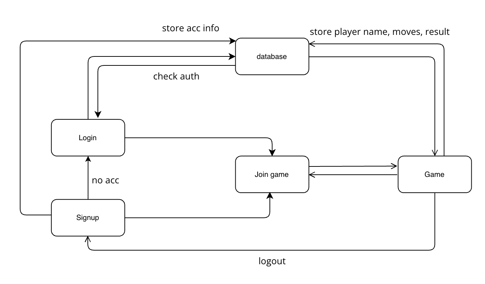

# Tic Tac Toe

# Description

An online Tic Tac Toe game for persons with disabilities (PWDs)

# Instructions for Loading and Playing the Web Application

Follow these steps to load the web application, create a game session, and play the game on 2 or more browsers.

## Steps

1. Update .env file with respective keys

2. Open a terminal and enter the following commands:

   ```bash
   cd client
   yarn start
   ```

3. Open another terminal and enter the following commands:
   ```bash
   cd server
   yarn install
   yarn start
   ```

- If playing locally on the same computer, play on [http://localhost:3000](http://localhost:3000). Make sure to use one normal browser and one incognito browser, as the game requires cookies.

# Design Decisions for Testing Web Application Accessibility for PWDs

## Overview

To enhance accessibility for Persons With Disabilities (PWDs), the web application was designed with specific considerations. Additionally, a video demonstration has been provided to illustrate the user experience for individuals with sensory impairments.

- **Video Demo Link:** [Web Application Accessibility Demo](https://drive.google.com/file/d/1QlXSi0sn6-ZB1r-GAINSvB4SMGcGm_9M/view?usp=sharing)

## Design Decisions

### Labels for Every Element

- **Objective:** Ensure screen readers can clearly explain each element's purpose.
- **Implementation:** Added labels for text input blanks and the tic-tac-toe box. Clearly instructed users to input or press enter to choose a square. Each box in the tic-tac-toe was labeled with row & column numbers, and content inside.

### Caption for Game History Table

- **Objective:** Provide context to screen reader users before entering the game history table.
- **Implementation:** Added a caption to the table, ensuring screen readers read it before presenting the table content.

### Labels for Row and Column IDs

- **Objective:** Assist screen readers in providing information about the table structure.
- **Implementation:** Labeled row and column numbers, helping screen readers announce the position before reading table content.

### Window Alerts for Moves

- **Objective:** Enhance interactivity by notifying users, especially PWDs, of each move or game end.
- **Implementation:** Integrated window alerts for every move made in the game or when the game ends, ensuring users are informed.

### Simple Website Design

- **Objective:** Create a user-friendly and easy-to-navigate website for PWDs.
- **Implementation:** Designed a simple website with minimal elements, focusing on an intuitive layout for easy navigation.

### Only Necessary Elements Selectable by Screen Reader

- **Objective:** Streamline user experience by limiting selectable elements to essential ones.
- **Implementation:** Ensured that only key elements, necessary for interaction, are selectable by screen readers, omitting purely aesthetic elements.

# List of API functions/specifications

## Overview

The TicTacToe API provides endpoints for creating and managing Tic Tac Toe games. It utilizes a PostgreSQL database to store game results and history.

## Base URL

All endpoints are relative to the base URL: `http://localhost:3001`

## 1. Create a New Game

### Endpoint

### Description

Create a new Tic Tac Toe game, input the name of Player 1 and increment move count.

### Request

```bash
curl -X POST -H "Content-Type: application/json" -d '{"name": "Player 1"}' http://localhost:3001/game
```

### Response

None

## 2. Input Player Two's Name and Increment Count

### Endpoint

PUT /game/playertwo

### Description

Input the name of Player 2 and increment move count.

### Request

```bash
curl -X PUT -H "Content-Type: application/json" -d '{"name": "Player 2"}' http://localhost:3001/game/playertwo
```

### Response

Returns the latest row of the created game.

## 3. Increment Move Count

### Endpoint

PUT /game/incrementCount

### Description

Increment the move count

### Request

```bash
curl -X PUT -H "Content-Type: application/json" -d '{"name": "<player_name>"}' http://localhost:3001/game/incrementCount
```

### Response

Returns the updated row with the incremented count.

## 4. Update Game End Result

### Endpoint

PUT /game/endResult

### Description

Input the end result of the game.

### Request

```bash
curl -X PUT -H "Content-Type: application/json" -d '{"endResult": "<result>"}' http://localhost:3001/game/endResult
```

### Response

Returns the updated row with the specified end result.

## 5. Get Latest Game

### Endpoint

GET /game

### Description

Retrieve the details of the latest tic-tac-toe game.

### Request

```bash
curl -X GET http://localhost:3001/game
```

### Response

Returns the details of the latest game, including game_id, player names, move count, and result.

## 6. Get All Game History

### Endpoint

GET /gameHistory

### Description

Retrieve the entire history of tic-tac-toe games.

### Request

```bash
curl -X GET http://localhost:3001/gameHistory
```

### Response

Returns an array containing details of all the tic-tac-toe games, including game_id, player names, move count, and result.

# User Signup and Authentication

## Overview

The User Signup and Authentication API provides endpoints for creating and managing user accounts. It utilizes stream-Chat server to store account information.

## 1. User Sign up

### Endpoint

POST /signup

### Description

Sign up a new user and generate an authentication token.

### Request

```bash
curl -X POST -H "Content-Type: application/json" -d '{"firstName": "<firstName>", "lastName": "<lastName>", "username": "<username>", "password": "<password>"}' http://localhost:3001/signup
```

### Response

Returns a JSON object containing the authentication token, user ID, first name, last name, username, and hashed password.

## 2. User Login

### Endpoint

POST /login

### Description

Authenticate a user by checking their credentials and return an authentication token.

### Request

```bash
curl -X POST -H "Content-Type: application/json" -d '{"username": "<username>", "password": "<password>"}' http://localhost:3001/login
```

### Response

Returns a JSON object containing the authentication token, first name, last name, username, and user ID if login is successful. If the user is not found or the password does not match, an appropriate message is returned.

# Summary on design/infra decisions and accessibility considerations.

In creating this project independently, I prioritized accessibility for Persons With Disabilities (PWDs). Labels were added to explain each element's purpose, from text inputs to tic-tac-toe boxes. Clear instructions guide users on input methods.

A caption was introduced for the game history table, providing context before presenting tabular data. Row and column numbers were labeled for structural clarity, aiding screen readers.

Interactive alerts were implemented to keep users, especially PWDs, informed about the game's progress. Window alerts accompany each move or game end, offering auditory cues.

The website features a clean, intuitive design with minimal elements, prioritizing ease of navigation for all users, including PWDs.

To streamline user interaction, only necessary elements are selectable by screen readers, excluding non-essential, purely aesthetic components.

In summary, this independent project underscores a commitment to accessibility, implementing concise design decisions and infrastructural considerations tailored to diverse user needs, particularly those with disabilities.

# Architecture diagram describing the infrastructure components.


